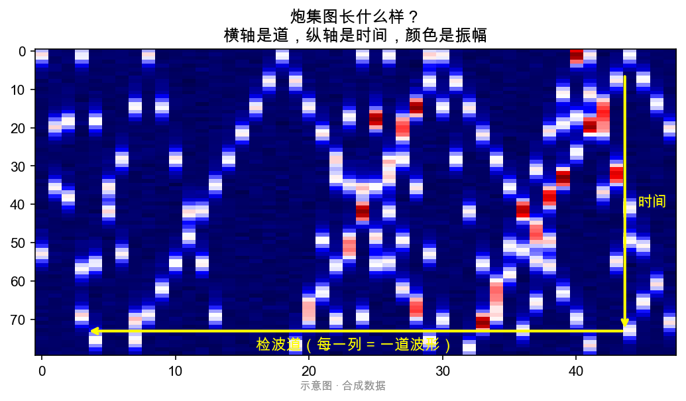
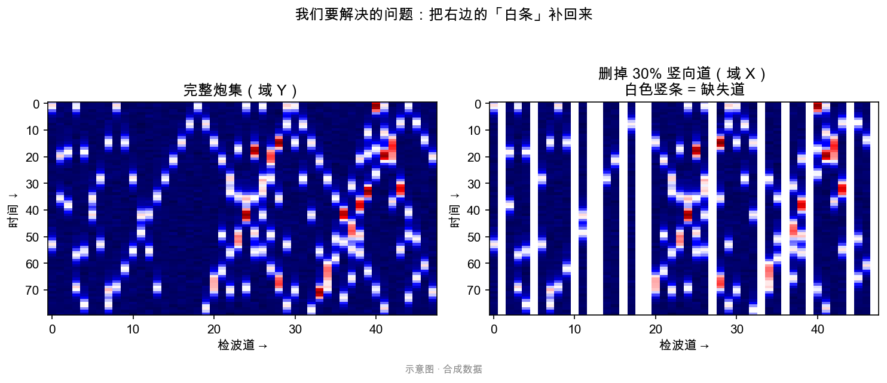
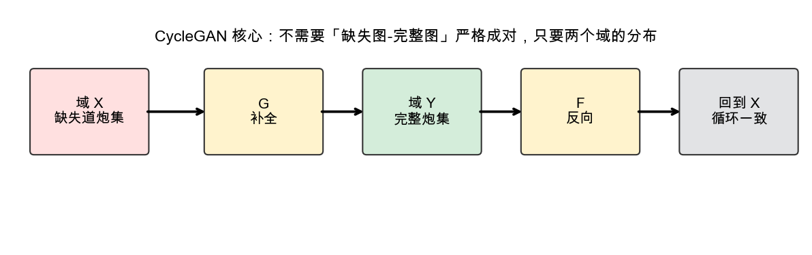
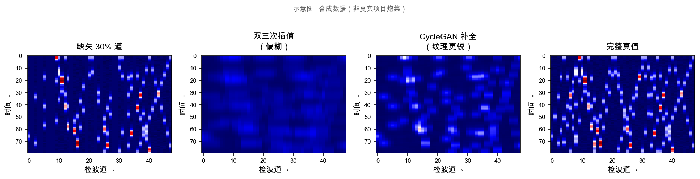
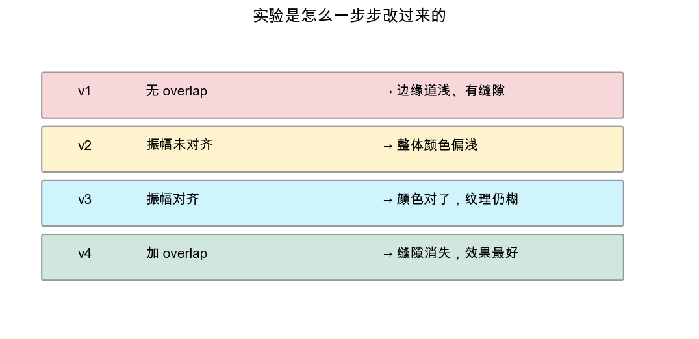
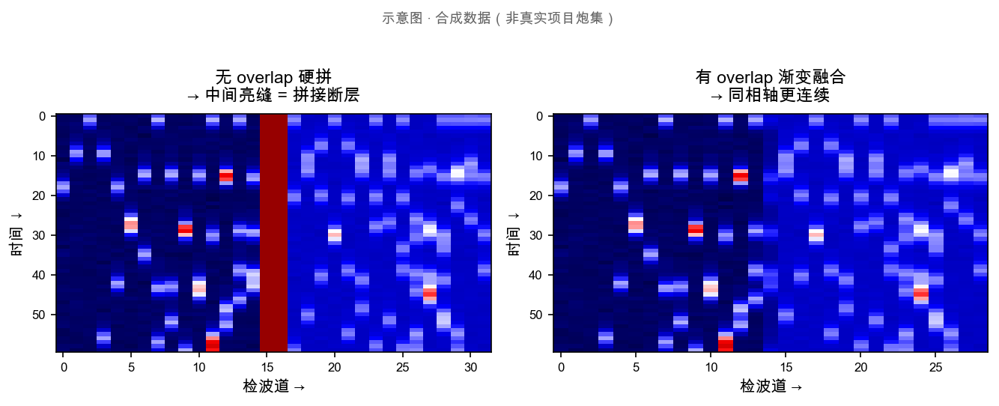
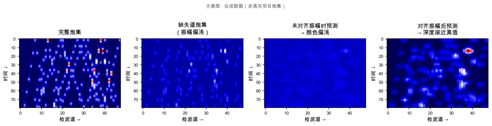
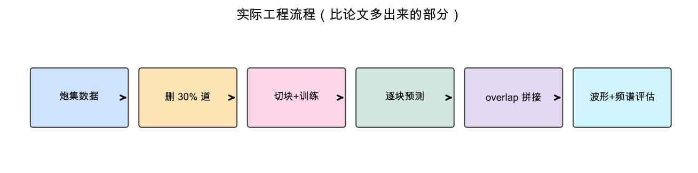
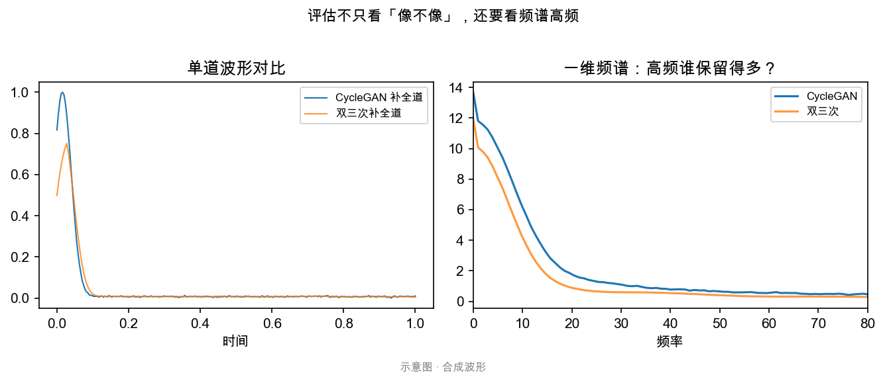

# 基于 CycleGAN 的地震道插值

记录本人在工作中做地震道插值的相关调研和实验。仓库里只有文档，没有原始炮集数据和训练代码（数据属于项目资产）。

文中的对比图是后来补的示意图，用来对照说明思路，不是当时的实验原图。如果有 Word 里的截图，可以按 [assets/images/README.md](assets/images/README.md) 替换。

图文版总览见 [docs/00-visual-guide.md](docs/00-visual-guide.md)。

---

## 项目概要

炮集可以看成二维图：横轴是检波道，纵轴是时间，像素值是振幅。实验里竖向删掉 30% 的道，模拟道缺失，再用 CycleGAN 把缺道炮集往完整炮集方向翻译。推理时按 patch 预测，用 overlap 拼回大图，最后用波形显示和频谱分析看效果。

---

## 炮集与问题定义

每一列对应一道检波器记录。缺道在图上表现为空白竖条。

左图是完整炮集，右图删掉约 30% 的道。要做的事就是把右图缺失的部分补出来。

---

## 方案选择

把「缺道炮集」和「完整炮集」当作两个域，用 CycleGAN 做非成对翻译。相比 pix2pix，不需要同一炮点的严格成对数据。原理见 [docs/03-methodology.md](docs/03-methodology.md)。

---

## 效果对比

| 方法 | 观察 |
|------|------|
| 双三次 | 能补上，但同相轴偏糊 |
| CycleGAN | 纹理相对更清楚一些 |
| 需要注意 | 两域振幅不一致时颜色会偏；不做 overlap 拼接会有缝 |

---

## 实验过程

| 阶段 | 调整 | 现象 |
|------|------|------|
| 第一轮 | 未做 overlap | 边缘道偏浅，拼接有缝 |
| 第二轮 | 振幅未对齐 | 预测图整体偏浅 |
| 第三轮 | 对齐振幅 | 颜色接近了，细节仍不够 |
| 第四轮 | 增加 overlap | 缝隙减轻，目前结果最好 |

详细记录见 [docs/05-experiments.md](docs/05-experiments.md)。

---

## 工程流程

除了训练模型，实际还做了数据切块、按文件名顺序预测、overlap 拼接，以及转 SEG-Y 后做频谱分析。论文里对推理拼接这部分写得比较少，落地时要自己补。

---

## 评估方式

除了看生成图，还会看波形变面积显示、相减图，以及一维/二维频谱。地震数据不太适合只看 MSE，平滑的结果 MSE 反而可能更低。

---

## 文档目录

| 文档 | 内容 |
|------|------|
| [00-visual-guide.md](docs/00-visual-guide.md) | 图文总览 |
| [01-background.md](docs/01-background.md) | 问题背景、传统插值 |
| [02-literature-review.md](docs/02-literature-review.md) | 文献调研 |
| [03-methodology.md](docs/03-methodology.md) | CycleGAN 与地震场景 |
| [04-data-pipeline.md](docs/04-data-pipeline.md) | 数据预处理 |
| [05-experiments.md](docs/05-experiments.md) | 实验记录 |
| [06-evaluation.md](docs/06-evaluation.md) | 评估方法 |
| [07-troubleshooting.md](docs/07-troubleshooting.md) | 问题记录 |

---

## 技术栈

TensorFlow 2，`tf.data` / `tensorflow_datasets`，U-Net 生成器，PatchGAN。数据用过 GOM 2D 和山地自研数据集。

---

## 主要工作

- 从传统插值到 GAN 论文调研，确定 CycleGAN 方案
- 搭建 TF2 数据管道，完成 overlap 切块和推理拼接
- 对比 overlap、训练轮数、U-Net/ResNet、振幅归一化等设置
- 处理过 Mac MPS 上 Adam 报错、预测空图、测试集尺寸不一致、shuffle 导致拼接乱序等问题

---

## 其他

- 示意图生成脚本：`scripts/generate_diagrams.py`
- CycleGAN 基础学习参考：[pytorch-CycleGAN-and-pix2pix](https://github.com/junyanz/pytorch-CycleGAN-and-pix2pix)

---

## License

文档采用 [CC BY 4.0](https://creativecommons.org/licenses/by/4.0/)。
