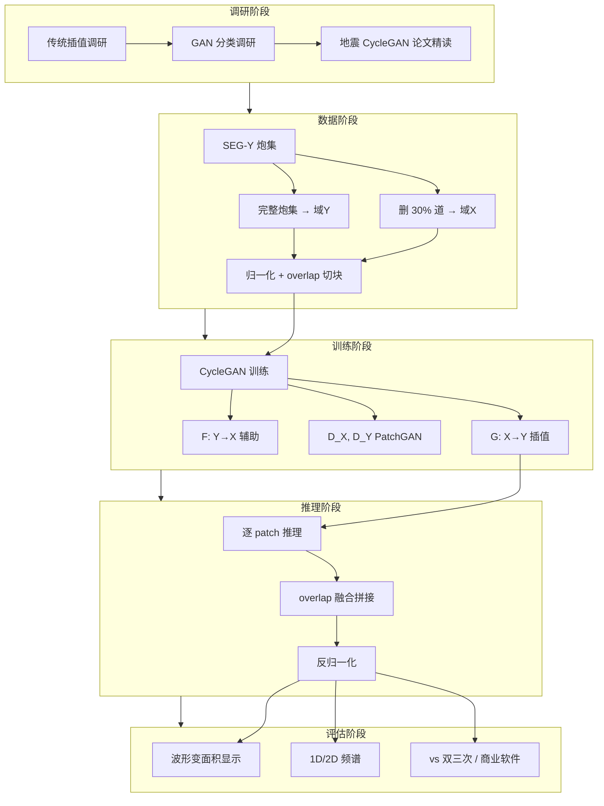
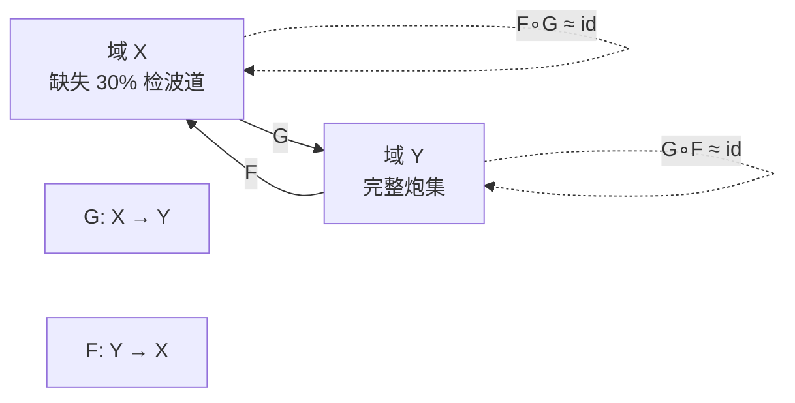

# 工作流程示意图

## 端到端流程

```mermaid
flowchart TB
    subgraph 调研阶段
        A1[传统插值调研] --> A2[GAN 分类调研]
        A2 --> A3[地震 CycleGAN 论文精读]
    end

    subgraph 数据阶段
        B1[SEG-Y 炮集] --> B2[删 30% 道 → 域X]
        B1 --> B3[完整炮集 → 域Y]
        B2 --> B4[归一化 + overlap 切块]
        B3 --> B4
    end

    subgraph 训练阶段
        B4 --> C1[CycleGAN 训练]
        C1 --> C2[G: X→Y 插值]
        C1 --> C3[F: Y→X 辅助]
        C1 --> C4[D_X, D_Y PatchGAN]
    end

    subgraph 推理阶段
        C2 --> D1[逐 patch 推理]
        D1 --> D2[overlap 融合拼接]
        D2 --> D3[反归一化]
    end

    subgraph 评估阶段
        D3 --> E1[波形变面积显示]
        D3 --> E2[1D/2D 频谱]
        D3 --> E3[vs 双三次 / 商业软件]
    end

    调研阶段 --> 数据阶段
    数据阶段 --> 训练阶段
    训练阶段 --> 推理阶段
    推理阶段 --> 评估阶段
```

## 域映射关系

```mermaid
graph LR
    X["域 X<br/>缺失 30% 检波道"]
    Y["域 Y<br/>完整炮集"]
    G["G: X → Y"]
    F["F: Y → X"]

    X -->|G| Y
    Y -->|F| X
    X -.->|F∘G ≈ id| X
    Y -.->|G∘F ≈ id| Y
```

可将上述 Mermaid 图在 GitHub README 中直接渲染。
