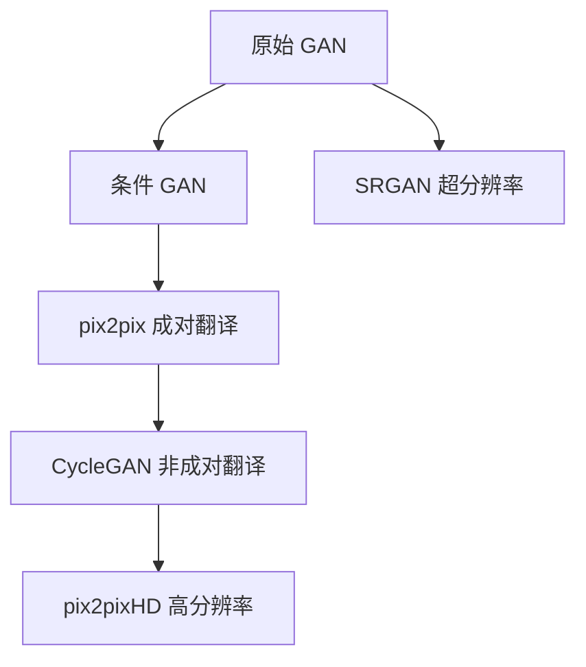

# 02 · 文献与方案调研

## 1. GAN 技术演进（调研笔记）

| 方法 | 数据要求 | 核心思想 | 与本项目关系 |
|------|----------|----------|--------------|
| **pix2pix** | 成对 (paired) | 输入轮廓/边缘 → 输出图像，U-Net + PatchGAN | 生成器结构参考 |
| **CycleGAN** | 非成对 (unpaired) | 循环一致性：A→B→A 应还原 | **主方案** |
| **SRGAN** | LR-HR 成对 | 感知损失 + 对抗损失，VGG 特征 | 频谱/纹理评估参考 |
| **StyleGAN** | 无监督 | 风格解耦 | 调研了解，未采用 |

---

## 2. 地震方向关键论文

### 2.1 Seismic data interpolation using deep learning with GANs

- **思路**：与 CycleGAN 闭环结构类似  
- **域 A**：删减检波道后的炮集  
- **域 B**：完整炮集  
- **损失**：L_GAN + L_cycle + L_self + L_identity → L_total  
- **训练**：Adam，200 epochs，3×3 卷积核，2D 例 64 滤波器  
- **意义**：直接验证 CycleGAN 用于地震插值的可行性 — **本文是工程落地的理论依据**

### 2.2 Deep learning for 3D seismic compressive-sensing

- **思路**：LR-HR 图像对，高斯模糊 + 下采样构造 LR  
- **损失**：内容损失（MSE / VGG 特征）+ 对抗损失  
- **结论**：纯 MSE 过于平滑；VGG 高层特征利于纹理  
- **意义**：说明**频域/感知损失**在地震场景的重要性，指导后续评估维度

---

## 3. pix2pix 与 CycleGAN 的选型逻辑

### 为何不用纯 pix2pix？

- pix2pix 需要**严格成对**数据（缺失道图 ↔ 完整道图，同一炮点同一对齐）  
- 实际中「缺失模式」多样，构造完美成对数据成本高

### 为何选 CycleGAN？

- 只需两个域的**分布**：「有缺失的炮集集合」vs「完整炮集集合」  
- 循环一致性约束防止模式崩塌，保持同相轴结构  
- 与地震论文方案一致，便于论文复现与对标

### CycleGAN 网络要点（实现笔记）

- **生成器 G, F**：编码器 → 6×ResBlock 转换器 → 解码器（或 U-Net 跳跃连接）  
- **判别器 D_X, D_Y**：PatchGAN，70×70 感受野  
- **优化器**：原论文 Adam，lr=2e-4，100 epoch 恒定 + 100 epoch 线性衰减  
- **本项目调整**：Adagrad / SGD / RMSProp（因 Mac MPS 兼容性），lr=0.001，40~200 epochs

---

## 4. 调研产出

- 形成 GAN 分类笔记（FCGAN、SGAN、应用与评估指标）  
- 明确 **pix2pix → CycleGAN** 的技术路线  
- 确定以**第二篇地震 CycleGAN 论文**为主参考，SRGAN 为评估参考

详见 [references.md](references.md)。
