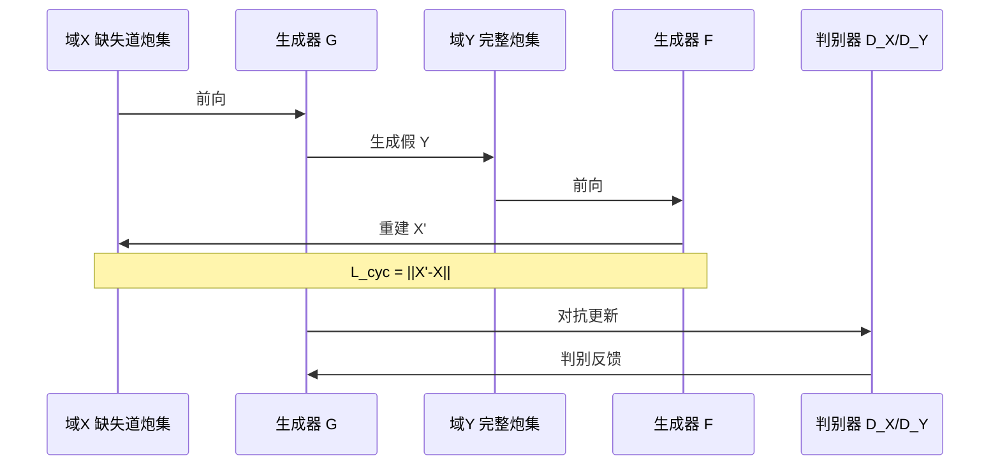

# 03 · CycleGAN 方法与地震场景映射

## 1. CycleGAN 核心原理

### 1.1 问题设定

给定两个**无配对**图像域 X 和 Y：

- G: X → Y（生成器）
- F: Y → X（逆生成器）
- D_X, D_Y：域判别器

目标：学习 G、F，使得 G(X) 在分布上接近 Y，且 F(G(x)) ≈ x。

### 1.2 损失函数

```
L(G, F, D_X, D_Y) =
    L_GAN(G, D_Y, X, Y)      # 对抗：G 骗过 D_Y
  + L_GAN(F, D_X, Y, X)
  + λ · L_cyc(G, F)          # 循环一致性：F(G(x))≈x, G(F(y))≈y
  + μ · L_identity(G, F)     # 恒等映射（可选）
```

- **λ = 10**（论文与项目一致）  
- **PatchGAN**：判别 70×70 patch 而非整图，关注局部纹理（同相轴走向）

### 1.3 训练流程



---

## 2. 地震场景映射

| CycleGAN 概念 | 地震插值映射 |
|---------------|--------------|
| 域 X | 删减 30% 检波道后的炮集图 |
| 域 Y | 完整炮集图 |
| G: X→Y | **插值生成器**：补全缺失道 |
| F: Y→X | 辅助生成器：完整→缺失（训练用） |
| 循环一致性 | 补全后再「删道」应接近原缺失图，防止胡编波形 |

### 2.1 与「超分辨率」路线的区别

- SRGAN：同一炮集的 LR/HR 对，强调**分辨率提升**  
- CycleGAN：两个域的**分布对齐**，强调**缺失模式 → 完整模式**的翻译  
- 地震论文选用后者，因缺失道与完整道**不是简单下采样关系**

### 2.2 生成器选型

| 结构 | 来源 | 特点 |
|------|------|------|
| **U-Net** | pix2pix | 跳跃连接保留浅层细节，适合结构对齐的图像翻译 |
| **ResNet** | CycleGAN 原论文 | 9 个残差块，全局感受野好 |

**项目实践**：以 U-Net 为主（与 pix2pix 代码复用），ResNet 作对照实验。

### 2.3 判别器

- PatchGAN 70×70  
- 输入：单通道或三通道炮集伪彩图  
- 输出：patch 级真/假概率图

---

## 3. 推理与拼接

训练在 **patch** 上进行，全尺寸炮集需：

1. **重叠切块**（overlap）— 避免边缘道生成质量差  
2. 逐 patch 推理  
3. **加权融合 / 中心裁剪** 拼接回大图  
4. 按**文件名排序**预测，避免 `shuffle` 导致乱序

> 重叠切块是解决「边缘道过浅、拼接缝隙」的关键工程手段（见 [07-troubleshooting.md](07-troubleshooting.md)）。

---

## 4. 与论文的差异（诚实说明）

| 项目 | 论文 | 本项目 |
|------|------|--------|
| 框架 | 未明确 / 多实现 | TensorFlow 2 |
| 优化器 | Adam | Adam 在 MPS 崩溃 → 换 Adagrad 等 |
| Epoch | 200 | 40 / 200 对比 |
| 切块 | 论文示例 | GOM + 自研山地，200² / 1024² |
| 缺失比例 | 30% 道 | 30% + 删前 5 道（近偏移） |

这些差异是**工程探索记录**，体现了项目迭代过程中的实际取舍。
