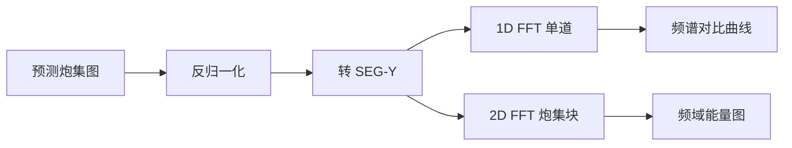

# 06 · 评估方法

## 1. 为什么需要多维度评估？

炮集插值不能只看「像不像照片」：

- **同相轴连续性**：地质解释依赖波形相位对齐  
- **频域保真**：高频丢失影响分辨率与薄层识别  
- **振幅保真**：叠加、反演对振幅敏感

因此采用 **视觉 + 频谱 + 残差** 组合评估。

---

## 2. 视觉评估

### 2.1 波形变面积显示（Wiggle）

- 将炮集转为标准地震工区显示方式  
- 对比：真值 / 插值结果 / 双三次基线  
- 关注：同相轴是否断开、分叉、假同相轴

### 2.2 伪彩色对比图

- 灰度或 RGB 炮集并排  
- **相减图**（prediction − ground truth）：亮区为误差集中带

### 2.3 大图拼接质量

- 检查 overlap 拼接处有无**竖向缝隙**  
- 道方向是否对齐（shuffle 乱序会表现为整体错位）

---

## 3. 频谱分析

### 3.1 一维频谱

- 沿时间轴对单道做 FFT  
- 对比插值道与相邻真值道的**主频、带宽**

### 3.2 二维频谱

- 对炮集块做 2D FFT  
- 观察**频域能量分布**是否向高频衰减  
- 流程：预测图 → 转 SEG-Y → 专业软件 / 自研脚本分析

### 3.3 解读要点

| 现象 | 可能含义 |
|------|----------|
| 高频明显低于真值 | 过平滑，类似双三次 |
| 高频噪声抬升 | 对抗训练过强或模式崩塌 |
| 低频一致、高频恢复 | 理想插值方向 |

---

## 4. 定量指标（规划 / 部分实践）

| 指标 | 说明 | 状态 |
|------|------|------|
| MSE / MAE | 像素级误差 | 可用，但地震更看结构 |
| SSIM | 结构相似性 | 可补充 |
| 相关系数 | 道与道之间 | 计划中 |
| SNR | 信噪比 | 与 RNA 对标时计划使用 |

> 说明：GAN 生成结果**不能仅用 MSE** — SRGAN 论文已论证 MSE 导致过度平滑；本项目借鉴该认识，重视频谱与视觉。

---

## 5. 对标对象

1. **双三次插值** — 快速基线  
2. **公司内部商业软件** — 工业标准参考  
3. **RNA（反褶积神经网络插值等）** — 传统高级方法，文档中列为后续对比  
4. **论文原图** — 验证实现方向正确

---

## 6. 评估结论示例

> 「我们在 GOM 和山地数据上，用波形显示和 2D 频谱对比 CycleGAN 与双三次。CycleGAN 在**同相轴纹理和高频能量**上优于传统插值，但在**patch 边缘**曾出现振幅偏浅，通过 overlap 拼接缓解。下一步计划引入感知损失并与 RNA 做定量 SNR 对比。」
